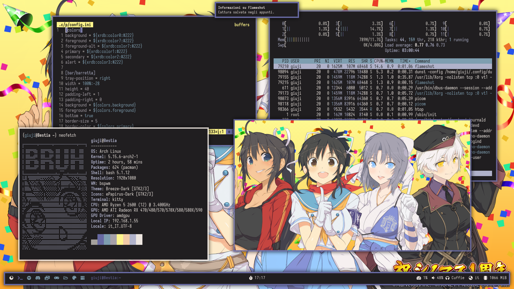

# archsible
(almost) automated arch workstation setup via ansible.
Probably the worst ansible playbook ever wrote pls don't judge my skills i'm still learning ok!?!?

## Usage
the playbook assumes a fresh arch installation with a sudo capable login user 
- clone the repo `git clone https://github.com/giuji/archsible`, `cd archsible`
- edit *group_vars/all/main.yml* and add your login user username
- install dependencies `ansible-galaxy collection install -r requirements.yml`
- add an [inventory file](https://docs.ansible.com/ansible/latest/user_guide/intro_inventory.html)
- run the playbook! `ansible-playbook playbook.yml -i *inventory* --diff -kK`

## Roles
role | description
--- | ---  
audio | installs pipewire
aur | creates user aur_builder and installs yay
bspwm | installs bspwm and its configuration files
dunst | installs dunst and its configuration files
flameshot | installs flameshot, its configuration files and creates a Screenshot folder
fonts | installs noto fonts, font awesome and iosevka
kitty | installs kitty and its configuration files
neofetch | installs neofetch and, adds custom ascii art and configuration file and places an alias in .bashrc 
picom | installs picom and its configuration file
polybar | installs polybar-git from the aur
pywal | installs pywal, creates .Xresources and a wallpaper folder
rofi | installs rofi and its configuration files
sxhkd | installs sxhkd and its configuration files
xorg | installs xorg and amdgpu driver, it also setups xinit on tty login
virt | installs virt-manager (**WIP** you need to install iptables-nft manually)
gtk | installs gtk, qt5, icon and cursor theme and applies them
mpv | installs mpv and its configurations files
jp | installs fcitx and mozc (**WIP** you need to config mozc manually)
zsh | sets zsh as default shell for user and copies my .zshrc
## TO-DO
- [x] Add a librewolf role that installs browser, its pywal theme and imports my librewolf profile
- [x] Add a virtualization role that configures and install virt-manager
- [x] Add a keyboard role that installs japanese keyboard layout
- [x] ~~Add a gtk role that sets breeze-dark as default gtk theme~~
- [x] ~~Add a mpv role that installs and setups mpv~~
- [ ] Add a packages role that installs all my favourite apps
- [ ] Add a podman role that installs podman and setups a proxy vpn container
- [x] ~~Add a neovim role that installs and configure neovim and its plugins~~
- [ ] Add a role that setups default apps
- [x] ~~Add role for auto usb mount~~
- [x] ~~Add a powermanager/acpi/screenlocker~~
